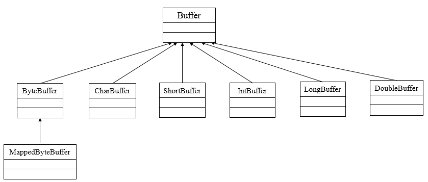

## Buffer
### 层次结构

### 基础
缓冲区是抱在一个对象内的基本数据源数组，四个重要属性
* 容量（capacity）：
    缓冲区能够容纳的数据元素的最大数量，容量在缓冲区创建时被设定，并且永远不能被改变。
* 上界（limit）：
    * 缓冲区的第一个不能被读或写的元素。或者说，缓冲区中现存元素的计数。
    * 在写模式，limit的含义是我们所能写入的最大数据量。它等同于buffer的容量。
    * 一旦切换到读模式，limit则代表我们所能读取的最大数据量，即现存元素的计数。
* 位置（position）：
    * 下一个要被读或写的元素的索引。位置会自动由相应的 get( )和 put( )函数更新。 
    * 当写入数据到Buffer的时候需要中一个确定的位置开始，默认初始化时这个位置position为0，一旦写入了数据比如一个字节，整形数据，那么position的值就会指向数据之后的一个单元，position最大可以到capacity-1。
    * 当从Buffer读取数据时，也需要从一个确定的位置开始。buffer从写入模式变为读取模式时，position会归零，每次读取后，position向后移动。
* 标记（mark）：
    一个备忘位置。调用 mark( )来设定 mark = postion。调用 reset( )设定 position = mark。标记在设定前是未定义的(undefined)。

### 分配一个Buffer
为了获取一个Buffer对象，你必须先分配。每个Buffer实现类都有一个allocate()方法用于分配内存。下面看一个实例，开辟一个48字节大小的buffer：
```java
ByteBuffer buf = ByteBuffer.allocate(48);
```
开辟一个1024个字符的CharBuffer
```java
CharBuffer charbuffer = CharBuffer.allocate(1024);
```

### 写入数据到Buffer
写数据到Buffer有两种方法：
* 从Channel中写数据到Buffer
    ```java
    int bytesRead = channel.read(buf);
    ```
* 手动写数据到Buffer，调用put方法
    ```java
    buf.put("123".getByte());
    ```

### 从Buffer中读取数据
从Buffer中读取数据两种方法：
* 从Buffer读数据写入到Channel
    ```java
    int bytesWritten = channel.write(buf);
    ```
* 从Buffer直接读取数据
    ```java
    byte b = buf.get();
    ```

### 方法
* filp()
    * 把Buffer从写模式切换到读模式。
    * 设置limit为当前position，并把position归零

* rewind()
    * 将position设置为0，可以重复读取buffer中的数据。

* clear()
    * 重置position为0，limit为capacity，也就是整个Buffer清空。实际上Buffer中数据并没有清空，我们只是把标记为修改了。

* compact()
    如果Buffer还有一些数据没有读取完，调用clear就会导致这部分数据被“遗忘”，因为我们没有标记这部分数据未读。
    * 针对这种情况，如果需要保留未读数据，那么可以使用compact。

* mark() and reset()
    * 通过mark方法可以标记当前的position，通过reset来恢复mark的位置。

* equals()
    判断两个buffer相对，需满足：
    * 两个对象类型相同
    * 两个对象都剩余同样数量的元素
    * 在每个缓冲区中应被 get()函数返回的剩余数据元素序列必须一致

