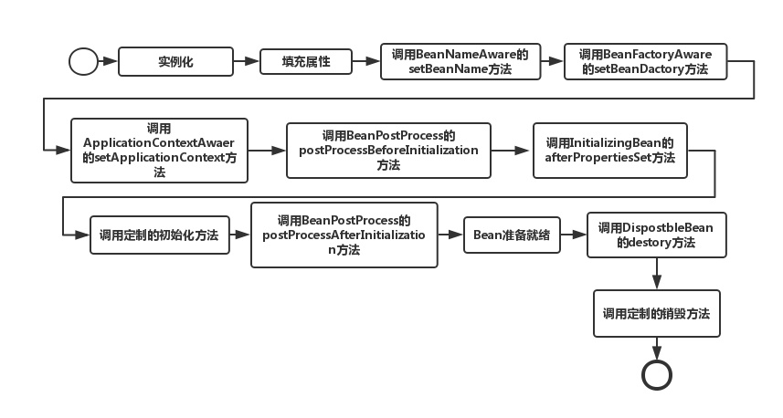

### 什么是Spring框架
它是一款为程序员解决开发中基础性问题，让程序员能更加关注业务实现的开源框架。它的内部集成了IOC，AOP，测试等模块

### 缓存注解
[参考1](https://www.cnblogs.com/fashflying/p/6908028.html)
[参考2](https://blog.csdn.net/qq_23121681/article/details/53995666)

1. @Cacheable
    1. 可以标记在一个方法上，也可以标记在一个类上。当标记在一个方法上时表示该方法是支持缓存的，当标记在一个类上时则表示该类所有的方法都是支持缓存的。
    1. 对于一个支持缓存的方法，Spring会在其**被调用后**将其返回值缓存起来，以保证下次利用同样的参数来执行该方法时可以直接从缓存中获取结果，而不需要再次执行该方法。Spring在缓存方法的返回值时是以键值对进行缓存的，值就是方法的返回结果
    1. Spring在每次执行前都会检查Cache中是否存在相同key的缓存元素，如果存在就不再执行该方法，而是直接从缓存中获取结果进行返回，否则才会执行并将返回结果存入指定的缓存中。
    1. PS:当一个支持缓存的方法在对象内部被调用时是不会触发缓存功能的。

    | 参数 | 解释 | example |
    | --- | --- | --- |
    | value | 缓存的名称，在 spring 配置文件中定义，必须指定至少一个 | @Cacheable(value=”mycache”)<br>@Cacheable(value={”cache1”,”cache2”}) |
    | key | 缓存的 key，可以为空，如果指定要按照 SpEL 表达式编写，如果不指定，则缺省按照方法的所有参数进行组合 | @Cacheable(value=”testcache”,key=”#userName”) |
    | condition | 缓存的条件，可以为空，使用 SpEL 编写，返回 true 或者 false，只有为 true 才进行缓存 | @Cacheable(value=”testcache”,condition=”#userName.length()>2”) |

1. @CachePut
    也可以标注在类上和方法上，能够根据方法的请求参数对其结果进行缓存，和 @Cacheable 不同的是，它 **每次都会触发真实方法的调用**
    | 参数 | 解释 | example |
    | --- | --- | --- |
    | value | 缓存的名称，在 spring 配置文件中定义，必须指定至少一个 | @CachePut(value=”my cache”) |
    | key | 缓存的 key，可以为空，如果指定要按照 SpEL 表达式编写，如果不指定，则缺省按照方法的所有参数进行组合 | @CachePut(value=”testcache”,key=”#userName”) |
    | condition | 缓存的条件，可以为空，使用 SpEL 编写，返回 true 或者 false，只有为 true 才进行缓存 | 	@CachePut(value=”testcache”,condition=”#userName.length()>2”) |

1. @CacheEvict
    用来标注在需要清除缓存元素的方法或类上的。
    1. 当标记在一个类上时表示其中所有的方法的执行都会触发缓存的清除操作。

    | 参数 | 解释 | example |
    | --- | --- | --- |
    | value | 缓存的名称，在 spring 配置文件中定义，必须指定至少一个 | @CachePut(value=”my cache”) |
    | key | 缓存的 key，可以为空，如果指定要按照 SpEL 表达式编写，如果不指定，则缺省按照方法的所有参数进行组合 | @CachePut(value=”testcache”,key=”#userName”) |
    | condition | 缓存的条件，可以为空，使用 SpEL 编写，返回 true 或者 false，只有为 true 才进行缓存 | 	@CachePut(value=”testcache”,condition=”#userName.length()>2”) |
    | allEntries | 是否清空所有缓存内容，缺省为 false，如果指定为 true，则 **方法调用后将立即清空所有缓存** | @CachEvict(value=”testcache”,allEntries=true) |
    | beforeInvocation | **是否在方法执行前就清空**，缺省为 false，如果指定为 true，则在方法还没有执行的时候就清空缓存，缺省情况下，如果方法执行抛出异常，则不会清空缓存 | @CachEvict(value=”testcache”，beforeInvocation=true) |

1. @CacheConfig
    所有的@Cacheable()里面都有一个value＝“xxx”的属性，这显然如果方法多了，写起来也是挺累的，如果可以一次性声明完 那就省事了， 
    所以，有了@CacheConfig这个配置，@CacheConfig is a class-level annotation that allows to share the cache names，如果你在你的方法写别的名字，那么依然以方法的名字为准。
    ```java
    @CacheConfig("books")
    public class BookRepositoryImpl implements BookRepository {

        @Cacheable
        public Book findBook(ISBN isbn) {...}
    }
    ```

1. @Caching
    有时候我们可能组合多个Cache注解使用；比如用户新增成功后，我们要添加id–>user；username—>user；email—>user的缓存；此时就需要@Caching组合多个注解标签了。
    ```java
    @Caching(put = {
        @CachePut(value = "user", key = "#user.id"),
        @CachePut(value = "user", key = "#user.username"),
        @CachePut(value = "user", key = "#user.email")
    })
    public User save(User user)
    ```

1. SpEL上下文数据
    | 名称 | 位置 | 描述 | 示例 |
    | --- | --- | --- | --- |
    | methodName | root对象 | 当前被调用的方法名 | #root.methodName |
    | method | root对象 | 当前被调用的方法 | #root.method |
    | target | root对象 | 当前被调用的目标对象 | #root.target |
    | targetClass | root对象 | 当前被调用的目标对象类 | #root.targetClass |
    | args | root对象 | 当前被调用的方法的参数列表 | #root.args[0] |
    | caches | root对象 | 当前方法调用使用的缓存列表（如@Cacheable(value={“cache1”, “cache2”})），则有两个cache | #root.caches[0].name |
    | argument name | 执行上下文 | 当前被调用的方法的参数，如findById(Long id)，我们可以通过#id拿到参数 | #user.id |
    | result | 执行上下文 | 方法执行后的返回值（仅当方法执行之后的判断有效，如‘unless’，’cache evict’的beforeInvocation=false） | #result |

### Spring AOP名称
面向切面编程，在执行业务的前后加入自定义方法，如日志记录、权限拦截。
* 切面：定义了某任务在何时何处完成功能
* 通知：切面的工作，定义了任务是什么以及何时完成
* 切点：定义了何处任务
* 连接点：即方法名
* 织入：把切面应到目标对象来创建新的代理对象。分为编译时织入、运行时织入
* 代理：JDK动态代理或CGLib动态代理

### Spring AOP实现
1. AspectJ使用了静态代理，通过生成一个代理类，将advise插入到业务类中，这样业务类在执行时就会回调advise方法，比运行时代理性能更好。
1. Spring Aop使用了动态代理，在运行时期对业务方法进行增强，所以不会生成新类，Spring提供了JDK动态代理的支持和CGLIB的支持，会去动态的选择用哪种方法。动态代理在使用注解实现时，需要AspectJ的标准注解，而配置文件方式不需要。
    1. JDK动态代理只能为接口创建动态代理，而不能对类创建，需要使用反射技术获得被代理类的接口信息，生成一个实现此接口的动态代理类（字节码），此代理类实质上是Proxy的子类。先用反射技术(Proxy.newProxyInstance())创建动态代理类的实例对象。
    新的代理类调用某个接口时，会在内部使用invokehandler.invoke()。invoke内部包括了代理逻辑和通过反射执行真正的method。JDK动态代理会代理接口内的所有方法。
    1. CGLib可以弥补JDK动态代理只能面向接口的缺点，需要asm包，原理是字节码技术为一个类创建子类。所以不能对final的类或者方法代理。比JDK性能高，但是创建的时间长

### Spring Bean作用域（scope属性）
* singleton：默认不管收到多少请求，每个容器里只有一个bean示例，单例的模式由beanfactory本身来维护
* prototype：为每一个获取示例的请求生成一个新的实例。
* request：在一次Http请求中，容器会返回该Bean的同一实例。而对不同的Http请求则会产生新的Bean，而且该bean仅在当前Http Request内有效。
* session：在一次Http Session中，容器会返回该Bean的同一实例。而对不同的Session请求则会创建新的实例，该bean实例仅在当前Session内有效。
* global session：在一个全局的Http Session中，容器会返回该Bean的同一个实例，仅在使用portlet（分布式开发）时有效。

### Spring Bean生命周期
* Spring容器可以管理singleton作用域下Bean的生命周期，在此作用域下，Spring能够精确地知道Bean何时被创建，何时初始化完成，以及何时被销毁。
* 而对于prototype作用域的Bean，Spring只负责创建，当容器创建了Bean的实例后，Bean的实例就交给了客户端的代码管理，Spring容器将不再跟踪其生命周期，并且不会管理那些被配置成prototype作用域的Bean的生命周期。

1.实例化: 此步骤中，bean 工厂容器从XML 配置文件中提供的bean 定义实例化bean.
2.填充属性:在此步骤中，bean 工厂容器按照XML配置文件中所指定的通过DI填充所有bean 属性。
3.设置bean 名称: 在此步骤中，在创建bean 的bean工厂中设置bean 的名称。这是通过将bean 的ID 传递给BeanNameAware 接口提供的setBeanName() 方法来完成的。
4.设置bean 工厂: 在此步骤中，为bean 提供对管理它的bean工厂的引用。这是使用BeanFactoryAware 接口的setBeanFactory() 方法来完成的。
5.预初始化: 在此步骤中，您执行在初始化bean 之前需要完成的任务。这是通过在bean类中实现BeanPostProcessor 接口并定义其postProcessBeforeInitialization 方法来完成的。
6.初始化bean: 在此步骤中，您执行某些类型的初始化任务，然后bean 才可供使用。这些任务包括打开文件、打开网络或数据库连接以及分配内存。这是通过在bean 类中实现InitiallzingBean接口并定义其afterPropertiesSet ()方法来完成的。
7.初始化后: 在此步骤中，您执行在初始化bean之后需要完成的任务。这是通过在bean 类中实现BeanPostProcessor 接口并定义其postProcessAfterInitialization() 方法来完成的。
8.bean 可供使用: 此时，bean 已准各就绪，可供应用程序使用，将留在bean工厂中，直到应用程序不再需要它。
9.销毁bean: 在此步骤中，将销毁bean。如果bean实现DisposableBean 接口，将调用destroy () 方法。然而，如果为bean声明了自定义destroy方法，将调用该方法。

### Spring依赖注入
1. 属性注入
1. 构造器注入
1. 工厂注入

可以注入简单值和map、set、list、数组，简单值注入使用＜property＞的value属性
```xml
<!-- setter通过property 注入属性值，普通类型使用value -->
<bean id="account" scope="prototype" class="com.zejian.spring.springIoc.pojo.Account" >
    <property name="name" value="I am SpringIOC1" />
    <property name="pwd" value="123" />
    <!-- 注入map -->
    <property name="books">  
        <map>  
          <entry key="10" value="CoreJava">  
            </entry>  
            <entry key="11" value="JavaWeb">  
            </entry>  
            <entry key="12" value="SSH2">  
            </entry>  
        </map>  
  </property>  
  <!-- 注入set -->
  <property name="friends">  
       <set>  
           <value>张龙</value>  
           <value>老王</value>  
           <value>王五</value>  
       </set>  
   </property>  
  <!-- 注入list -->
   <property name="citys">  
       <list>  
           <value>北京</value>  
           <value>上海</value>  
           <value>深圳</value>
           <value>广州</value>  
       </list>  
   </property>  
</bean>
```

### Spring循环依赖
IOC容器将循环依赖分为两种：属性依赖与构造依赖，前者是常见的对于成员变量的依赖，后者是在构造器中存在互相依赖。
* 属性依赖问题：依靠三级缓存，实现了提前暴露的机制，在加载A时发现了B的依赖，转而去加载B，加载B时发现了A的依赖，此时由于提前暴露，可以直接拿到A的实例。（参考下一题）
* 构造依赖问题：假设A和B是构造依赖的，并且没有被IOC实例化过。容器在执行A的构造器时发现B需要加载，就转去加载B，并将A记录在singletonsCurrentlyInCreation集合中。当执行B的时候发现需要加载A，但这时A已经在singletonsCurrentlyInCreation集合中了。此时会抛出BeanCurrentlyInCreationException。

### Spring属性循环依赖解决
* Spring单例对象的初始化其实可以分为三步：
    1. createBeanInstance， 实例化，实际上就是调用对应的构造方法构造对象，此时只是调用了构造方法，spring xml中指定的property并没有进行填充
    1. populateBean，填充属性，这步对spring xml中指定的property进行populate
    1. initializeBean，调用spring xml中指定的init方法，或者AfterPropertiesSet方法
    会发生循环依赖的步骤集中在第一步和第二步。
* 三级缓存
    * 一级缓存-singletonObjects：存储了单例对象的cache
    * 二级缓存-earlySingletonObjects：单例对象工厂的cache
    * 三级缓存-singletonFactories：提前曝光的单例对象的cache
* 过程
    * A首先完成了初始化的第一步，并且将自己提前曝光到singletonFactories（三级缓存）中，此时进行初始化的第二步，发现自己依赖对象B，此时就尝试去get(B)，发现B还没有被create，所以走create流程，B在初始化第一步的时候发现自己依赖了对象A，于是尝试get(A)，尝试一级缓存singletonObjects（肯定没有，因为A还没初始化完全），尝试二级缓存earlySingletonObjects（也没有），尝试三级缓存singletonFactories，由于A通过ObjectFactory将自己提前曝光了，所以B能够通过ObjectFactory.getObject拿到A对象（A还没有初始化完全），B拿到A对象后顺利完成了初始化阶段1、2、3，完全初始化之后将自己放入到一级缓存singletonObjects中。此时返回A中，A此时能拿到B的对象顺利完成自己的初始化阶段2、3，最终A也完成了初始化，进去了一级缓存singletonObjects中。

### 设值注入、构造注入
* 构造函数依赖注入时，Spring保证一个对象所有依赖的对象先实例化后，才实例化这个对象。
* 设值依赖注入时，Spring首先实例化对象，然后才实例化所有依赖的对象。

### 事务传播行为 [参考](https://blog.csdn.net/tsj11514oo/article/details/52389124)
Service接口方法可能会在内部调用其它的Service接口方法以共同完成一个完整的业务操作，因此就会产生服务接口方法嵌套调用的情况， Spring通过事务传播行为控制当前的事务如何传播到被嵌套调用的目标服务接口方法中。
| 传播行为 | 意义 |
| - | - |
| PROPAGATION_REQUIRED | 表示当前方法必须运行在一个事务中，如果当前存在一个事务，那么该方法运行在这个事务中，否则，将创建一个新的事务 |
| PROPAGATION_REQUIRES_NEW | 表示当前方法必须运行在自己的事务中，如果当前存在一个事务，那么这个事务将在该方法运行期间被挂起 |
| PROPAGATION_MANDATORY | 表示方法必须运行在一个事务中，如果当前事务不存在，就抛出异常|
| PROPAGATION_NEVER | 表示方法不能运行在一个事务中，否则抛出异常 |
| PROPAGATION_NOT_SUPPORTED | 表示方法不能运行在一个事务中，如果当前存在一个事务，则该方法将被挂起 |
| PROPAGATION_SUPPORTS | 表示当前方法不需要运行在一个是事务中，但如果有一个事务已经存在，该方法也可以运行在这个事务中 |
PROPAGATION_NESTED | 表示如果当前事务存在，则方法应该运行在一个嵌套事务中。否则，它看起来和 PROPAGATION_REQUIRED 看起来没什么俩样 |