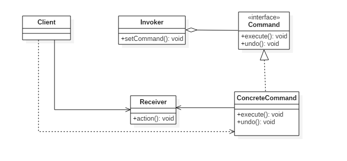
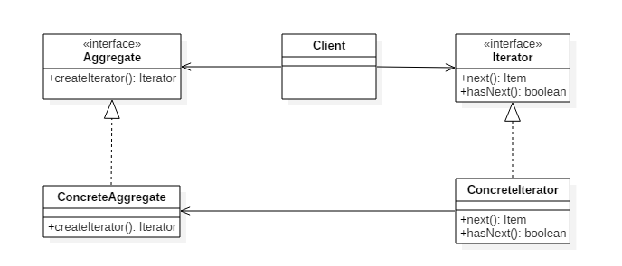
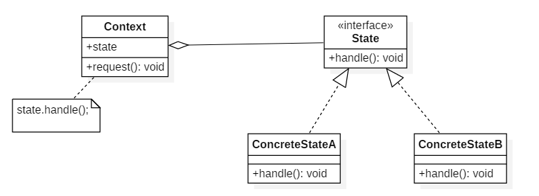
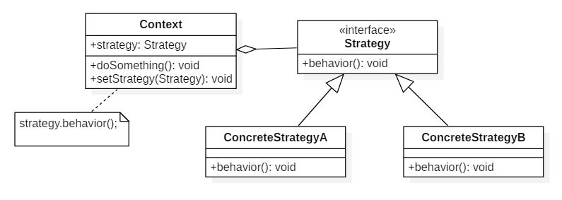
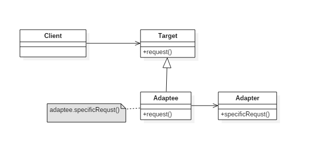
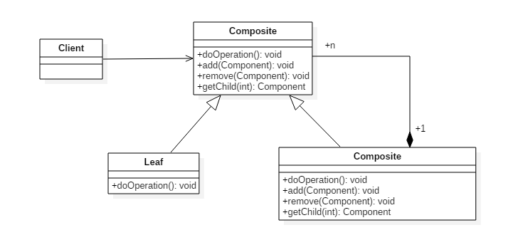
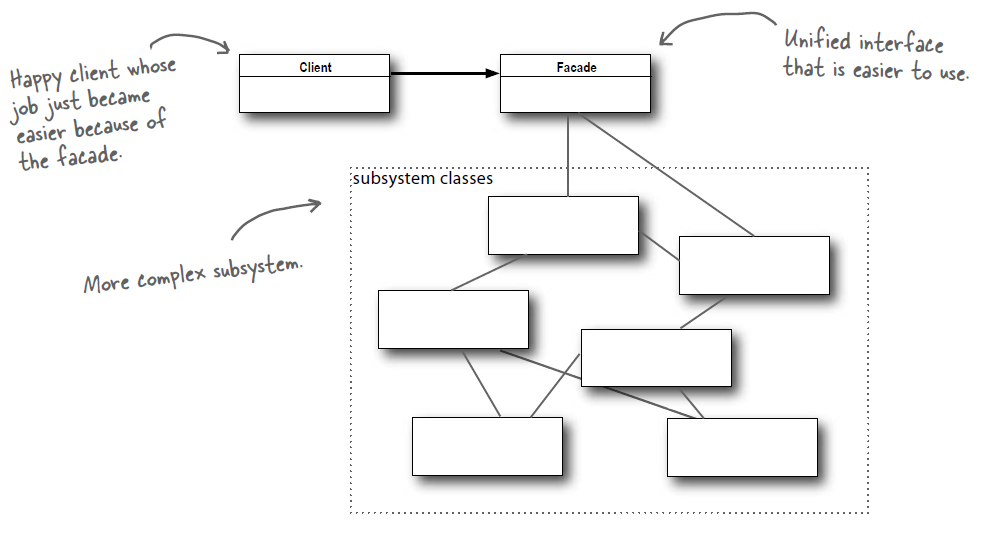

## 创建型
### 单例（Singleton）
#### 含义
确保一个类只有一个实例，并提供该实例的全局访问点。
#### 类图

#### 实现
+ 懒汉式-线程不安全
    ```java
    public class Singleton {
        private static Singleton INSTANCE;

        private Singleton() {}

        public static Singleton getSingleton() {
            if (INSTANCE == null) {
                INSTANCE = new Singleton();
            }
            return INSTANCE;
        }
    }
    ```

+ 饿汉式-线程安全
    ```java
    public class Singleton {
        private static final INSTANCE = new Singleton();

        private Singleton() {}

        public static Singleton getSingleton() {
            return INSTANCE;
        }
    }
    ```

+ 饿汉式-线程安全
    ```java
    public class Singleton {
        private static Singleton INSTANCE;

        private Singleton() {}

        public static synchronized Singleton getSingleton() {
            if (INSTANCE == null) {
                INSTANCE = new Singleton();
            }
            return INSTANCE;
        }
    }
    ```

+ 双重检验锁-线程安全
    ```java
    public class Singleton {
        private volatile static Singleton INSTANCE;

        private Singleton() {}

        public static Singleton getSingleton() {
            if (singleton == null) {
                synchronized(Singleton.class) {
                    if (singleton == null) {
                        INSTANCE = new Singleton();
                    }
                }
            }
            return INSTANCE;
        }
    }
    ```

+ 静态内部类-线程安全
    ```java
    public class Singleton {

        private Sintleton() {}

        private static class SingletonHolder {
            private static final Singleton INSTANCE = new Singleton();
        }

        public static Singleton getSingleton() {
            return SingletonHolder.INSTANCE;
        }
    }
    ```

### 简单工厂（Simple Factory）
#### 含义
在创建一个对象时不向客户暴露内部细节，并提供一个创建对象的通用接口。
#### 类图
不是设计模式。把实例化的操作单独放到一个类中，这个类就成为简单工厂类，让简单工厂类来决定应该用哪个具体子类来实例化。
把客户类和具体子类实现解耦，客户类不再需要知道有哪些子类以及应当实例化哪个子类。客户类往往有多个，如果不使用简单工厂，那么所有的客户类都要知道所有子类的细节。而且一旦子类发生改变，例如增加子类，那么所有的客户类都要进行修改。

#### 实现
```java
public interface Product {
}
```
```java
public class ConcreteProductA implements Product {
}
```
```java
public class ConcreteProductB implements Product {
}
```
```java
public class SimpleFactory {
    public static Product createProduct(Char type) {
        if (type == 'A') {
            return new ConcreteProductA();
        } else if (type == 'B') {
            return new ConcreteProductB();
        }
        return null;
    }
}
```
```java
public class Client {
    public static void main(String[] args) {
        Product productA = SimpleFactory.createProduct('A');
    }
}
```

### 工厂方法（Factory Method）
#### 含义
定义了一个创建对象的接口，但由子类决定要实例化哪个类。工厂方法把实例化操作推迟到子类。
#### 类图
在工厂方法中，是由子类来创建对象的。

#### 实现
```java
public abstract class Factory {
    public abstract Product factoryMethod();

    public void doSomething() {
        Product product = factoryMethod();
    }
}
```
```java
public class ConreteProductAFactory extends Factory {
    public Product factoryMethod() {
        return new ConreteProductA();
    }
}
```
```java
public class ConreteProductBFactory extends Factory {
    public Product factoryMethod() {
        return new ConreteProductB();
    }
}
```

### 抽象工厂（Abstract Factory）
#### 含义
提供一个接口，用于创建**相关的对象家族**。
#### 类图
抽象工厂模式创建的对象家族，也就是**很多对象**而不是一个对象，并且这些对象是相关的，也就是说必须一起创建出来。而工厂方法只是用于创建一个对象，这个抽象工厂模式有很大的不同。
抽象工厂模式是通过工厂方法模式来创建单一对象，AbstractFactory中的createProductA()和createProductB()方法都是让子类来实现的，这两个方法单独来看就是在创建一个对象。
从高层次看，抽象工厂使用了组合，而工厂方法使用了继承。

#### 实现
```java
public class AbstractProductA {
}
```
```java
public class AbstractProductB {
}
```
```java
public class ProductA1 extends AbstractProductA {
}
```
```java
public class ProductA2 extends AbstractProductA {
}
```
```java
public class ProductB1 extends AbstractProductB {
}
```
```java
public class ProductB2 extends AbstractProductB {
}
```
```java
public abstract class AbstractFactory {
    public abstract AbstractProductA createProductA();
    public abstract AbstractProductB createProductB();
}
```
```java
public class ConreteFactory1 extends AbstractFactory {
    public AbstractProductA createProductA() {
        return new ProductA1();
    }
    public AbstractProductB createProductB() {
        return new ProductB1();
    }
}
```
```java
public class ConreteFactory2 extends AbstractFactory {
    public AbstractProductA createProductA() {
        return new ProductA2();
    }
    public AbstractProductB createProductB() {
        return new ProductB2();
    }
}
```
```java
public class Client {
    public static void main(String[] args) {
        AbstractFactory abstractFactory = new ConcreteFactory1();
        AbstractProductA productA = abstractFactory.createProductA();
        AbstractProductB productB = abstractFactory.createProductB();
    }
}
```

### 建造者（Builder）
#### 含义
封装一个对象的构造过程，并允许按步骤构造。
#### 类图

#### 实现
```java
public class Computer {
    public String master;
    public String screen;
    public String keyboard;
    public String mouse;
    public String audio;
    public void setMaster(String master) {
        this.master = master;
    }
    public void setScreen(String screen) {
        this.screen = screen;
    }
    public void setKeyboard(String keyboard) {
        this.keyboard = keyboard;
    }
    public void setMouse(String mouse) {
        this.mouse = mouse;
    }
    public void setAudio(String audio) {
        this.audio = audio;
    }
}
```
```java
public abstract class ComputerBuilder {
    protected Computer computer;
    
    public Computer getComputer() {
        return computer;
    }
    
    public void buildComputer() {
        computer = new Computer();
        System.out.println("生成了一台电脑！！！");
    }

    public abstract void buildMaster();
    public abstract void buildScreen();
    public abstract void buildKeyboard();
    public abstract void buildMouse();
    public abstract void buildAudio();
}
```
```java
public class HPComputerBuilder extends ComputerBuilder {
    @Override
    public void buildMaster() {
        // TODO Auto-generated method stub
        computer.setMaster("i7,16g,512SSD,1060");
        System.out.println("(i7,16g,512SSD,1060)的惠普主机");
    }

    @Override
    public void buildScreen() {
        // TODO Auto-generated method stub
        computer.setScreen("1080p");
        System.out.println("(1080p)的惠普显示屏");
    }

    @Override
    public void buildKeyboard() {
        // TODO Auto-generated method stub
        computer.setKeyboard("cherry 青轴机械键盘");
        System.out.println("(cherry 青轴机械键盘)的键盘");
    }

    @Override
    public void buildMouse() {
        // TODO Auto-generated method stub
        computer.setMouse("MI 鼠标");
        System.out.println("(MI 鼠标)的鼠标");
    }

    @Override
    public void buildAudio() {
        // TODO Auto-generated method stub
        computer.setAudio("飞利浦 音响");
        System.out.println("(飞利浦 音响)的音响");
    }
}
```
```java
public class Director {
    private ComputerBuilder computerBuilder;

    public void setComputerBuilder(ComputerBuilder computerBuilder) {
        this.computerBuilder = computerBuilder;
    }
    
    public Computer getComputer() {
        return computerBuilder.getComputer();
    }
    
    public void constructComputer() {
        computerBuilder.buildComputer();
        computerBuilder.buildMaster();
        computerBuilder.buildScreen();
        computerBuilder.buildKeyboard();
        computerBuilder.buildMouse();
        computerBuilder.buildAudio();
    }

}
```
```java
public class Client {
    public static void main(String[] args) {
        Director director = new Director();
        ComputerBuilder hp = new HPComputerBuilder();
        director.setComputerBuilder(hp);
        director.constructComputer();
        Computer pc = director.getComputer();
    }
}
```


## 行为型
### 命令（Command）
#### 含义
将命令封装成对象中，具有以下作用：
+ 使用命令来参数化其他对象
+ 将命令放入队列中进行排队
+ 将命令的操作记录到日志中
+ 支持可撤销的操作
#### 类图
+ Command：命令
+ Receiver：命令接收者，也就是命令的真正的执行者
+ Invoker：通过它来调用命令
+ Client：可以设置命令与命令的接收者

#### 实现
```java
public class Light {
    public void on() {
        System.out.println("Light is on!");
    }

    public void off() {
        System.out.println("Light is off!");
    }
}
```
```java
public interface Command {
    void execute();
}
```
```java
public class LightOnCommand implements Command {
    Light light;

    public LightOnCommand(Light light) {
        this.light = light;
    }

    @Override
    public void execute() {
        light.on();
    }
}
```
```java
public class LightOffCommand implements Command {
    Light light;

    public LightOffCommand(Light light) {
        this.light = light;
    }

    @Override
    public void execute() {
        light.off();
    }
}
```
```java
/**
 * 遥控器
 */
public class Invoker {
    private Command[] onCommand;
    private Command[] offCommand;
    private final int slotNum = 7;

    public Invoker() {
        this.onCommands = new Command[slotNum];
        this.offCommands = new Command[slotNum];
    }

    public void setOnCommand(Command command, int slot) {
        onCommands[slot] = command;
    }

    public void setOffCommand(Command command, int slot) {
        offCommands[slot] = command;
    }

    public void onButtonWasPushed(int slot) {
        onCommands[slot].execute();
    }

    public void offButtonWasPushed(int slot) {
        offCommands[slot].execute();
    }
}
```
```java
public class Client {
    public static void main(String[] args) {
        Invoker invoker = new Invoker();
        Light light = new Light();
        Command lightOnCommand = new LightOnCommand(light);
        Command lightOffCommand = new LightOffCommand(light);
        invoker.setOnCommand(lightOnCommand, 0);
        invoker.setOffCommand(lightOffCommand, 0);
        invoker.onButtonWasPushed(0);
        invoker.offButtonWasPushed(0);
    }
}
```

### 迭代器（Iterator）
#### 含义
提供一种顺序访问聚合对象的方法，并且不暴露聚合对象的内部表示。
#### 类图
+ Aggregate是聚合类，其中createIterator()方法可以产生一个Iterator；
+ Iterator主要定义了hasNext()和next()；
+ Client组合了Aggregate，为了迭代遍历Aggregate，也需要组合Iterator。

#### 实现
```java
public interface Iterator<T> {
    T next();

    boolean hasNext();
}
```
```java
public class ConcreteIterator implements Iterator<Integer> {
    private Integer[] items;
    private int position = 0;

    public ConcreteIterator(Integer[] items) {
        this.items = items;
    }

    @Override
    public Object next() {
        return items[position++];
    }

    @Override
    public boolean hasNext() {
        return position < items.length;
    }
}
```
```java
public interface Aggregate {
    Iterator createIterator();
}
```
```java
public class ConcreteAggregate implements Aggregate {
    private Integer[] items;

    public ConcreteAggregate() {
        items = new Integer[10];
        for (int i = 0; i < items.length; i++) {
            items[i] = i;
        }
    }

    @Override
    public Iterator createIterator() {
        return new ConcreteIterator<Integer>(items);
    }
}
```

### 观察者（Observer）
#### 含义
定义对象之间的一对多依赖，当一个对象状态改变时，他的所有依赖都会收到通知并且自动更新状态。
#### 类图
主题（Subject）：具有注册和移除观察者、并通知所有观察者的功能，主题是通过维护一张观察者列表来实现这些操作的。
观察者（Observer）：注册功能需要调用主题的registerObserver()方法。

#### 实现
```java
public interface Observer {
    void update(float temp, float humidity, float pressure);
}
```
```java
public class StatisticsDisplay implements Observer {
    public StatisticsDisplay(Subject weatherData) {
        weatherData.resisterObserver(this);
    }

    @Override
    public void update(float temp, float humidity, float pressure) {
        System.out.println("StatisticsDisplay.update: " + temp + " " + humidity + " " + pressure);
    }
}
```
```java
public interface Subject {
    void registerObserver(Observer o);
    void removeObserver(Observer o);
    void notifyObserver();
}
```
```java
public class WeatherData implements Subject {
    private List<Observer> observers;
    private float temperature;
    private float humidity;
    private float pressure;

    public WeatherData() {
        observers = new ArrayList<>();
    }

    public void setMeasurements(float temperature, float humidity, float pressure) {
        this.temperature = temperature;
        this.humidity = humidity;
        this.pressure = pressure;
        notifyObserver();
    }

    @Override
    public void resisterObserver(Observer o) {
        observers.add(o);
    }

    @Override
    public void removeObserver(Observer o) {
        int i = observers.indexOf(o);
        if (i >= 0) {
            observers.remove(i);
        }
    }

    @Override
    public void notifyObserver() {
        for (Observer o : observers) {
            o.update(temperature, humidity, pressure);
        }
    }
}
```
```java
public class Client {
    public static void main(String[] args) {
        WeatherData weatherData = new WeatherData();
        StatisticsDisplay statisticsDisplay1 = new StatisticsDisplay(weatherData);
        StatisticsDisplay statisticsDisplay2 = new StatisticsDisplay(weatherData);

        weatherData.setMeasurements(0, 0, 0);
    }
}
```

### 状态（State）
#### 含义
允许对象在内部状态改变时改变它的行为，对象看起来好像修改了它所属的类。
#### 类图

#### 实现
```java
public interface State {
    /**
     * 投入 25 分钱
     */
    void insertQuarter();

    /**
     * 退回 25 分钱
     */
    void ejectQuarter();

    /**
     * 转动曲柄
     */
    void turnCrank();

    /**
     * 发放糖果
     */
    void dispense();
}
```
```java
public class HasQuarterState implements State {
    private GumballMachine gumballMachine;

    public HasQuarterState(GumballMachine gumballMachine) {
        this.gumballMachine = gumballMachine;
    }

    @Override
    public void insertQuarter() {
        System.out.println("You can't insert another quarter");
    }

    @Override
    public void ejectQuarter() {
        System.out.println("Quarter returned");
        gumballMachine.setState(gumballMachine.getNoQuarterState());
    }

    @Override
    public void turnCrank() {
        System.out.println("You turned...");
        gumballMachine.setState(gumballMachine.getSoldState());
    }

    @Override
    public void dispense() {
        System.out.println("No gumball dispensed");
    }
}
```
```java
public class NoQuarterState implements State {
    GumballMachine gumballMachine;

    public NoQuarterState(GumballMachine gumballMachine) {
        this.gumballMachine = gumballMachine;
    }

    @Override
    public void insertQuarter() {
        System.out.println("You insert a quarter");
        gumballMachine.setState(gumballMachine.getHasQuarterState());
    }

    @Override
    public void ejectQuarter() {
        System.out.println("You haven't insert a quarter");
    }

    @Override
    public void turnCrank() {
        System.out.println("You turned, but there's no quarter");
    }

    @Override
    public void dispense() {
        System.out.println("You need to pay first");
    }
}
```
```java
public class SoldOutState implements State {
    GumballMachine gumballMachine;

    public SoldOutState(GumballMachine gumballMachine) {
        this.gumballMachine = gumballMachine;
    }

    @Override
    public void insertQuarter() {
        System.out.println("You can't insert a quarter, the machine is sold out");
    }

    @Override
    public void ejectQuarter() {
        System.out.println("You can't eject, you haven't inserted a quarter yet");
    }

    @Override
    public void turnCrank() {
        System.out.println("You turned, but there are no gumballs");
    }

    @Override
    public void dispense() {
        System.out.println("No gumball dispensed");
    }
}
```
```java
public class SoldState implements State {
    GumballMachine gumballMachine;

    public SoldState(GumballMachine gumballMachine) {
        this.gumballMachine = gumballMachine;
    }

    @Override
    public void insertQuarter() {
        System.out.println("Please wait, we're already giving you a gumball");
    }

    @Override
    public void ejectQuarter() {
        System.out.println("Sorry, you already turned the crank");
    }

    @Override
    public void turnCrank() {
        System.out.println("Turning twice doesn't get you another gumball!");
    }

    @Override
    public void dispense() {
        gumballMachine.releaseBall();
        if (gumballMachine.getCount() > 0) {
            gumballMachine.setState(gumballMachine.getNoQuarterState());
        } else {
            System.out.println("Oops, out of gumballs");
            gumballMachine.setState(gumballMachine.getSoldOutState());
        }
    }
}
```
```java
public class GumballMachine {
    private State soldOutState;
    private State noQuarterState;
    private State hasQuarterState;
    private State soldState;

    private State state;
    private int count = 0;

    public GumballMachine(int numberGumballs) {
        count = numberGumballs;
        soldOutState = new SoldOutState(this);
        noQuarterState = new NoQuarterState(this);
        hasQuarterState = new HasQuarterState(this);
        soldState = new SoldState(this);

        if (numberGumballs > 0) {
            state = noQuarterState;
        } else {
            state = soldOutState;
        }
    }

    public void insertQuarter() {
        state.insertQuarter();
    }

    public void ejectQuarter() {
        state.ejectQuarter();
    }

    public void turnCrank() {
        state.turnCrank();
        state.dispense();
    }

    public void setState(State state) {
        this.state = state;
    }

    public void releaseBall() {
        System.out.println("A gumball comes rolling out the slot...");
        if (count != 0) {
            count -= 1;
        }
    }

    public State getSoldOutState() {
        return soldOutState;
    }

    public State getNoQuarterState() {
        return noQuarterState;
    }

    public State getHasQuarterState() {
        return hasQuarterState;
    }

    public State getSoldState() {
        return soldState;
    }

    public int getCount() {
        return count;
    }
}
```
```java
public class Client {
    public static void main(String[] args) {
        GumballMachine gumballMachine = new GumballMachine(5);

        gumballMachine.insertQuarter();
        gumballMachine.turnCrank();

        gumballMachine.insertQuarter();
        gumballMachine.ejectQuarter();
        gumballMachine.turnCrank();

        gumballMachine.insertQuarter();
        gumballMachine.turnCrank();
        gumballMachine.insertQuarter();
        gumballMachine.turnCrank();
        gumballMachine.ejectQuarter();

        gumballMachine.insertQuarter();
        gumballMachine.insertQuarter();
        gumballMachine.turnCrank();
        gumballMachine.insertQuarter();
        gumballMachine.turnCrank();
        gumballMachine.insertQuarter();
        gumballMachine.turnCrank();
    }
}
```

### 策略（Strategy）
#### 含义
定义一系列算法，封装每个算法，并使它们可以互换。
策略模式可以让算法独立于使用它的客户端。
#### 类图
+ Strategy：定义了一个算法族，它们都实现了behavior()方法。
+ Context是使用到该算法族的类，其中的doSomething()方法会调用behavior()，setStrategy()方法可以动态地改变strategy对象，也就是说能动态该表Context所使用的算法。

#### 与状态模式比较
状态模式的类图和策略模式类似，并且都是能够动态改变对象的行为。但是状态模式是通过状态转移来改变 Context 所组合的 State 对象，而策略模式是通过 Context 本身的决策来改变组合的 Strategy 对象。所谓的状态转移，是指 Context 在运行过程中由于一些条件发生改变而使得 State 对象发生改变，注意必须要是在运行过程中。
状态模式主要是用来解决状态转移的问题，当状态发生转移了，那么 Context 对象就会改变它的行为；而策略模式主要是用来封装一组可以互相替代的算法族，并且可以根据需要动态地去替换 Context 使用的算法。
#### 实现
```java
public interface QuackBehavior {
    void quack();
}
```
```java
public class Quack implements QuackBehavior {
    @Override
    public void quack() {
        System.out.println("quack!");
    }
}
```
```java
public class Squeak implements QuackBehavior{
    @Override
    public void quack() {
        System.out.println("squeak!");
    }
}
```
```java
public class Duck {
    private QuackBehavior quackBehavior;

    public void preformQuack() {
        if (quackBehavior != null) {
            quackBehavior.quack();
        }
    }

    public void setQuackBehavior(QuackBehavior quackBehavior) {
        this.quackBehavior = quackBehavior;
    }
}
```
```java
public class Client {
    public static void main(String[] args) {
        Duck duck = new Duck();
        duck.setQuackBehavior(new Squeak());
        duck.performQuack();
        duck.setQuackBehavior(new Quack());
        duck.performQuack();
    }
}
```

### 模板方法（Template Method）
#### 含义
定义算法框架，并将一些步骤的实现延迟到子类。
通过模板方法，子类可以重新定义算法的某些步骤，而不用改变算法的结构。
#### 类图

#### 实现
```java
public abstract class CaffeineBeverage {
    final void prepareRecipe() {
        boilWater();
        brew();
        pourInCup();
        addCondiments();
    }

    abstract void brew();

    abstract void addCondiments();

    void boilWater() {
        System.out.println("boilWater");
    }

    void pourInCup() {
        System.out.println("pourInCup");
    }
}
```
```java
public class Coffee extends CaffeineBeverage {
    @Override
    void brew() {
        System.out.println("Coffee.brew");
    }

    @Override
    void addCondiments() {
        System.out.println("Coffee.addCondiments");
    }
}
```
```java
public class Tea extends CaffeineBeverage {
    @Override
    void brew() {
        System.out.println("Tea.brew");
    }

    @Override
    void addCondiments() {
        System.out.println("Tea.addCondiments");
    }
}
```
```java
public class Client {
    public static void main(String[] args) {
        CaffeineBeverage caffeineBeverage = new Coffee();
        caffeineBeverage.prepareRecipe();
        System.out.println("-----------");
        caffeineBeverage = new Tea();
        caffeineBeverage.prepareRecipe();
    }
}
```


## 结构型
### 适配器（Adapter）
#### 含义
把一个类接口转换成另一个用户需要的接口。
#### 类图

#### 实现
鸭子（Duck）和火鸡（Turkey）拥有不同的叫声，Duck 的叫声调用 quack() 方法，而 Turkey 调用 gobble() 方法。
要求将 Turkey 的 gobble() 方法适配成 Duck 的 quack() 方法，从而让火鸡冒充鸭子！
```java
public interface Duck {
    void quack();
}
```
```java
public interface Turkey {
    void gobble();
}
```
```java
public class WildTurkey implements Turkey {
    @Override
    public void gobble() {
        System.out.println("gobble!");
    }
}
```
```java
public class TurkeyAdapter implements Duck {
    Turkey turkey;

    public TurkeyAdapter(Turkey turkey) {
        this.turkey = turkey;
    }

    @Override
    public void quack() {
        turkey.gobble();
    }
}
```
```java
public class Client {
    public static void main(String[] args) {
        Turkey turkey = new WildTurkey();
        Duck duck = new TurkeyAdapter(turkey);
        duck.quack();
    }
}
```

### 组合（Composite）
#### 含义
将对象组合成树状结构来表示“整体/部分”层次关系，允许用户以想用的方式处理单独对象和组合对象。
#### 类图
组件（Component）类是组合类（Composite）和叶子类（Leaf）的父类，可以把组合类看成是树的中间节点。
组合对象拥有一个或者多个组件对象，因此组合对象的操作可以委托给组件对象去处理，而组件对象可以是另一个组合对象或者叶子对象。

#### 实现
```java
public abstract class Component {
    protected String name;

    public Component(String name) {
        this.name = name;
    }

    public void print() {
        print(0);
    }

    abstract void print(int level);

    abstract public void add(Component component);

    abstract public void remove(Component component);
}
```
```java
public class Composite extends Component {
    private List<Component> child;

    public Composite(String name) {
        super(name);
        child = new ArrayList<>();
    }

    @Override
    void print(int level) {
        for (int i = 0; i < level; i++) {
            System.out.print("--");
        }
        System.out.println("Composite:" + name);
        for (Component component : child) {
            component.print(level + 1);
        }
    }

    @Override
    public void add(Component component) {
        child.add(component);
    }

    @Override
    public void remove(Component component) {
        child.remove(component);
    }
}
```
```java
public class Leaf extends Component {
    public Leaf(String name) {
        super(name);
    }

    @Override
    void print(int level) {
        for (int i = 0; i < level; i++) {
            System.out.print("--");
        }
        System.out.println("left:" + name);
    }

    @Override
    public void add(Component component) {
        // 牺牲透明性换取单一职责原则，这样就不用考虑是叶子节点还是组合节点
        throw new UnsupportedOperationException();
    }

    @Override
    public void remove(Component component) {
        throw new UnsupportedOperationException();
    }
}
```
```java
public class Client {
    public static void main(String[] args) {
        Composite root = new Composite("root");
        Component node1 = new Leaf("1");
        Component node2 = new Composite("2");
        Component node3 = new Leaf("3");
        root.add(node1);
        root.add(node2);
        root.add(node3);
        Component node21 = new Leaf("21");
        Component node22 = new Composite("22");
        node2.add(node21);
        node2.add(node22);
        Component node221 = new Leaf("221");
        node22.add(node221);
        root.print();
    }
}
```

### 装饰（Decorator）
#### 含义
为对象动态添加功能。
#### 类图
装饰者（Decorator）和具体组件（ConcreteComponent）都继承自组件（Component），具体组件的方法实现不需要依赖于其它对象，而装饰者组合了一个组件，这样它可以装饰其它装饰者或者具体组件。所谓装饰，就是把这个装饰者套在被装饰者之上，从而动态扩展被装饰者的功能。装饰者的方法有一部分是自己的，这属于它的功能，然后调用被装饰者的方法实现，从而也保留了被装饰者的功能。可以看到，具体组件应当是装饰层次的最低层，因为只有具体组件的方法实现不需要依赖于其它对象。

#### 实现
设计不同种类的饮料，饮料可以添加配料，比如可以添加牛奶，并且支持动态添加新配料。每增加一种配料，该饮料的价格就会增加，要求计算一种饮料的价格。
```java
public interface Beverage {
    double cost();
}
```
```java
// 组件
public class DarkRoast implements Beverage {
    @Override
    public double cost() {
        return 1;
    }
}
```
```java
// 组件
public class HouseBlend implements Beverage {
    @Override
    public double cost() {
        return 1;
    }
}
```
```java
// 抽象装饰者
public abstract class CondimentDecorator implements Beverage {
    protected Beverage beverage;
}
```
```java
// 装饰者
public class Milk extends CondimentDecorator {
    public Milk(Beverage beverage) {
        this.beverage = beverage;
    }

    @Override
    public double cost() {
        return 1 + beverage.cost();
    }
}
```
```java
// 装饰者
public class Mocha extends CondimentDecorator {
    public Mocha(Beverage beverage) {
        this.beverage = beverage;
    }

    @Override
    public double cost() {
        return 1 + beverage.cost();
    }
}
```
```java
public class Client {
    public static void main(String[] args) {
        Beverage beverage = new HouseBlend();
        beverage = new Mocha(beverage);
        beverage = new Milk(beverage);
        System.out.println(beverage.cost());
    }
}
```
#### 设计原则
类应该对扩展开放，对修改关闭。

### 外观（Facade）
#### 含义
提供了一个统一的接口，用来访问子系统中的一群接口，从而让子系统更容易使用。
#### 类图

#### 实现
观看电影需要操作很多电器，使用外观模式实现一键看电影功能。
```java
public class SubSystem {
    public void turnOnTV() {
        System.out.println("turnOnTV()");
    }

    public void setCD(String cd) {
        System.out.println("setCD( " + cd + " )");
    }

    public void starWatching(){
        System.out.println("starWatching()");
    }
}
```
```java
public class Facade {
    private SubSystem subSystem = new SubSystem();

    public void watchMovie() {
        subSystem.turnOnTV();
        subSystem.setCD("a movie");
        subSystem.starWatching();
    }
}
```
```java
public class Client {
    public static void main(String[] args) {
        Facade facade = new Facade();
        facade.watchMovie();
    }
}
```
#### 设计原则
最少知识原则：只和你的密友谈话。也就是说客户对象所需要交互的对象应当尽可能少。

### 代理（Proxy）
#### 含义
控制对其他对象的访问。
#### 类图
代理有以下四类：
+ 远程代理（Remote Proxy）：控制对远程对象（不同地址空间）的访问，它负责将请求及其参数进行编码，并向不同地址空间中的对象发送已经编码的请求。
+ 虚拟代理（Virtual Proxy）：根据需要创建开销很大的对象，它可以缓存实体的附加信息，以便延迟对它的访问，例如在网站加载一个很大图片时，不能马上完成，可以用虚拟代理缓存图片的大小信息，然后生成一张临时图片代替原始图片。
+ 保护代理（Protection Proxy）：按权限控制对象的访问，它负责检查调用者是否具有实现一个请求所必须的访问权限。
+ 智能代理（Smart Reference）：取代了简单的指针，它在访问对象时执行一些附加操作：记录对象的引用次数；当第一次引用一个持久化对象时，将它装入内存；在访问一个实际对象前，检查是否已经锁定了它，以确保其它对象不能改变它。

#### 实现
以下是一个虚拟代理的实现，模拟了图片延迟加载的情况下使用与图片大小相等的临时内容去替换原始图片，直到图片加载完成才将图片显示出来。
```java
public interface Image {
    void showImage();
}
```
```java
public class HighResolutionImage implements Image {
    private URL imageURL;
    private long startTime;
    private int height;
    private int width;

    public int getHeight() {
        return height;
    }

    public int getWidth() {
        return width;
    }

    public HighResolutionImage(URL imageURL) {
        this.imageURL = imageURL;
        this.startTime = System.currentTimeMillis();
        this.width = 600;
        this.height = 600;
    }

    public boolean isLoad() {
        // 模拟图片加载，延迟 3s 加载完成
        long endTime = System.currentTimeMillis();
        return endTime - startTime > 3000;
    }

    @Override
    public void showImage() {
        System.out.println("Real Image: " + imageURL);
    }
}
```
```java
public class ImageProxy implements Image {
    private HighResolutionImage highResolutionImage;

    public ImageProxy(HighResolutionImage highResolutionImage) {
        this.highResolutionImage = highResolutionImage;
    }

    @Override
    public void showImage() {
        while (!highResolutionImage.isLoad()) {
            try {
                System.out.println("Temp Image: " + 
                    highResolutionImage.getWidth() + " " + 
                    highResolutionImage.getHeight());
                Thread.sleep(100);
            } catch (InterruptedException e) {
                e.printStackTrace();
            }
        }
        highResolutionImage.showImage();
    }
}
```
```java
public class ImageViewer {
    public static void main(String[] args) throws Exception {
        String image = "http://image.jpg";
        URL url = new URL(image);
        HighResolutionImage highResolutionImage = new HighResolutionImage(url);
        ImageProxy imageProxy = new ImageProxy(highResolutionImage);
        imageProxy.showImage();
    }
}
```

### 适配器 VS 装饰者 VS 外观
+ 适配器将一个对象包装起来以改变其接口；
+ 装饰者将一个对象包装起来以增加新的行为和责任；
+ 外观将一群“对象包装”起来以简化其接口。
