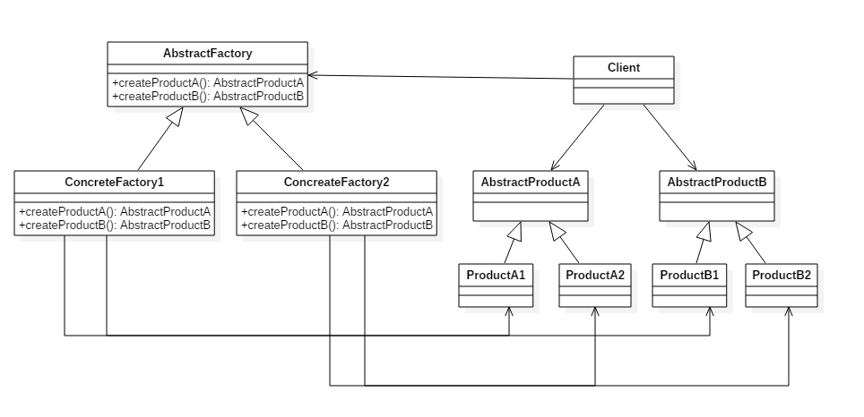

### 单例（Singleton）
#### 含义
确保一个类只有一个实例，并提供该实例的全局访问点。
#### 类图

#### 实现
+ 懒汉式-线程不安全
    ```java
    public class Singleton {
        private static Singleton INSTANCE;

        private Singleton() {}

        public static Singleton getSingleton() {
            if (INSTANCE == null) {
                INSTANCE = new Singleton();
            }
            return INSTANCE;
        }
    }
    ```

+ 饿汉式-线程安全
    ```java
    public class Singleton {
        private static final INSTANCE = new Singleton();

        private Singleton() {}

        public static Singleton getSingleton() {
            return INSTANCE;
        }
    }
    ```

+ 饿汉式-线程安全
    ```java
    public class Singleton {
        private static Singleton INSTANCE;

        private Singleton() {}

        public static synchronized Singleton getSingleton() {
            if (INSTANCE == null) {
                INSTANCE = new Singleton();
            }
            return INSTANCE;
        }
    }
    ```

+ 双重检验锁-线程安全
    ```java
    public class Singleton {
        private volatile static Singleton INSTANCE;

        private Singleton() {}

        public static Singleton getSingleton() {
            if (singleton == null) {
                synchronized(Singleton.class) {
                    if (singleton == null) {
                        INSTANCE = new Singleton();
                    }
                }
            }
            return INSTANCE;
        }
    }
    ```

+ 静态内部类-线程安全
    ```java
    public class Singleton {

        private Sintleton() {}

        private static class SingletonHolder {
            private static final Singleton INSTANCE = new Singleton();
        }

        public static Singleton getSingleton() {
            return SingletonHolder.INSTANCE;
        }
    }
    ```

### 简单工厂（Simple Factory）
#### 含义
在创建一个对象时不向客户暴露内部细节，并提供一个创建对象的通用接口。
#### 类图
不是设计模式。把实例化的操作单独放到一个类中，这个类就成为简单工厂类，让简单工厂类来决定应该用哪个具体子类来实例化。
把客户类和具体子类实现解耦，客户类不再需要知道有哪些子类以及应当实例化哪个子类。客户类往往有多个，如果不使用简单工厂，那么所有的客户类都要知道所有子类的细节。而且一旦子类发生改变，例如增加子类，那么所有的客户类都要进行修改。

#### 实现
```java
public interface Product {
}
```
```java
public class ConcreteProductA implements Product {
}
```
```java
public class ConcreteProductB implements Product {
}
```
```java
public class SimpleFactory {
    public static Product createProduct(Char type) {
        if (type == 'A') {
            return new ConcreteProductA();
        } else if (type == 'B') {
            return new ConcreteProductB();
        }
        return null;
    }
}
```
```java
public class Client {
    public static void main(String[] args) {
        Product productA = SimpleFactory.createProduct('A');
    }
}
```

### 工厂方法（Factory Method）
#### 含义
定义了一个创建对象的接口，但由子类决定要实例化哪个类。工厂方法把实例化操作推迟到子类。
#### 类图
在工厂方法中，是由子类来创建对象的。

#### 实现
```java
public abstract class Factory {
    public abstract Product factoryMethod();

    public void doSomething() {
        Product product = factoryMethod();
    }
}
```
```java
public class ConreteProductAFactory extends Factory {
    public Product factoryMethod() {
        return new ConreteProductA();
    }
}
```
```java
public class ConreteProductBFactory extends Factory {
    public Product factoryMethod() {
        return new ConreteProductB();
    }
}
```

### 抽象工厂（Abstract Factory）
#### 含义
提供一个接口，用于创建**相关的对象家族**。
#### 类图
抽象工厂模式创建的对象家族，也就是**很多对象**而不是一个对象，并且这些对象是相关的，也就是说必须一起创建出来。而工厂方法只是用于创建一个对象，这个抽象工厂模式有很大的不同。
抽象工厂模式是通过工厂方法模式来创建单一对象，AbstractFactory中的createProductA()和createProductB()方法都是让子类来实现的，这两个方法单独来看就是在创建一个对象。
从高层次看，抽象工厂使用了组合，而工厂方法使用了继承。

#### 实现
```java
public class AbstractProductA {
}
```
```java
public class AbstractProductB {
}
```
```java
public class ProductA1 extends AbstractProductA {
}
```
```java
public class ProductA2 extends AbstractProductA {
}
```
```java
public class ProductB1 extends AbstractProductB {
}
```
```java
public class ProductB2 extends AbstractProductB {
}
```
```java
public abstract class AbstractFactory {
    public abstract AbstractProductA createProductA();
    public abstract AbstractProductB createProductB();
}
```
```java
public class ConreteFactory1 extends AbstractFactory {
    public AbstractProductA createProductA() {
        return new ProductA1();
    }
    public AbstractProductB createProductB() {
        return new ProductB1();
    }
}
```
```java
public class ConreteFactory2 extends AbstractFactory {
    public AbstractProductA createProductA() {
        return new ProductA2();
    }
    public AbstractProductB createProductB() {
        return new ProductB2();
    }
}
```
```java
public class Client {
    public static void main(String[] args) {
        AbstractFactory abstractFactory = new ConcreteFactory1();
        AbstractProductA productA = abstractFactory.createProductA();
        AbstractProductB productB = abstractFactory.createProductB();
    }
}
```