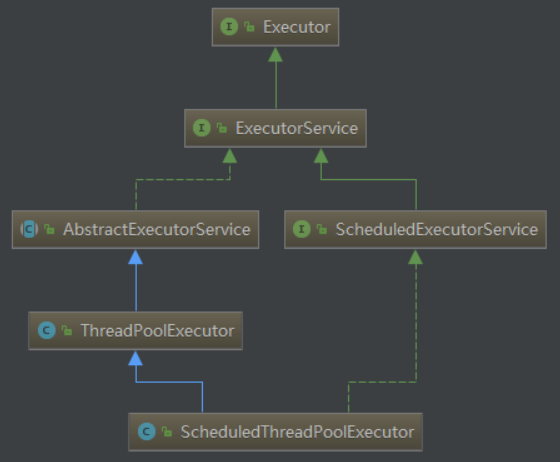

### java虚拟机内存模型
### 内存溢出一般发生在哪个区？永久代会不会导致内存溢出？
* 栈（包括虚拟机栈和本地方法栈）
    * 线程请求的栈深度大于虚拟机所允许的最大深度，将抛出StackOverflowError
    * 虚拟机在扩展栈深度时无法申请到足够的内存空间，将抛出OutOfMemberError
* 堆
    * 创建对象时如果没有可以分配的堆内存，JVM就会抛出OutOfMemoryError:java heap space异常。
    * 分清内存泄露还是 内存容量不足。泄露则看对象如何被 GC Root 引用，不足则通过调大-Xms，-Xmx参数。 
* 方法区
    * 1.7之前，String.intern()导致常量池溢出；1.7及后，导致堆溢出。
    * Class对象未被释放，Class对象占用信息过多，有过多的Class对象。 
* 直接内存
    * NIO 直接操作内存。

### 动态加载类的框架了解哪些？

### 动态代理一般有哪几种实现方式？动态代理的应用场景有哪些？
* jdk静态代理；jdk动态代理；cglib代理；
* 应用场景：
    1. 在原方法执行之前和之后做一些操作，可以用代理来实现（比如记录Log，做事务控制等）。 
    2. 封装真实的主题类，将真实的业务逻辑隐藏，只暴露给调用者公共的主题接口。 

### 栈会不会溢出？栈溢出一般抛什么异常？jvm在哪里设置栈的大小？设置的参数是什么？
* 会。StackOverflowError。由于hotspot并不区分虚拟机栈和本地方法栈，JVM启动参数-Xoss（设置本地方法栈大小）是无效的，stack的容量只能由-Xss设定。

### 用过哪些命令查看jvm的状态、堆栈信息？

### jvm的垃圾回收机制？
* 分代回收：
    1. 所有new出来的对象都会最先分配到新生代区域中，两个survivor区域初始化是为空的
    1. 当eden区域满了之后，就引发一次 minor GC
    1. 当在minor GC，存活下来的对象就会被移动到S0survivor区域
    1. 然后当eden区域又填满的时候，又会发生下一次的垃圾回收，存活的对象会被移动到survivor区域而未存活对象会被直接删除。但是，不同的是，在这次的垃圾回收中，存活对象和之前的survivor中的存活的对象都会被移动到s1中。一旦所有对象都被移动到s1中，那么s0中的对象就会被清除
    1. 下一次垃圾回收的时候，又会重复上次的步骤，清除需要回收的对象，并且又切换一次survivor区域，所有存活的对象都被移动至s0。eden和s1区域被清除。
    1. 重复以上步骤，并记录对象的年龄，当有对象的年龄到达一定的阈值的时候，就将新生代中的对象移动到老年代中。
    1. 接下来垃圾收集器就会重复以上步骤，不断的进行对象的清除和年代的移动

### java类加载机制？如何实现自定义类加载器？findClass与loadClass的区别？
* 机制：
    1. 加载：通过一个类的全限定名来获取定义此类的二进制字节流，在内存中生成一个代表这个类的Class对象。
    1. 验证：确保 Class 文件的字节流中包含的信息符合当前虚拟机的要求，并且不会危害虚拟机自身的安全。（包括：文件验证、字节码验证、元数据验证、符号引用验证）
    1. 准备：类变量分配内存并设置初始值（0，null），（使用的是方法区的内存）如果类变量是常量，那么会按照表达式来进行初始化，而不是赋值为 0。
    1. 解析：将符号引用替换为直接引用。
    1. 初始化：执行静态代码块和初始化静态成员变量。如果有超类，先执行超类的。
* 自定义类加载器：
    * 实现自定义类加载器需要继承ClassLoader或者URLClassLoader，继承ClassLoader则需要自己重写findClass()方法并编写加载逻辑，继承URLClassLoader则可以省去编写findClass()方法以及class文件加载转换成字节码流的代码。
* 区别：
    * 在JDK1.2之前，在自定义类加载时，总会去继承ClassLoader类并重写loadClass方法，从而实现自定义的类加载类；JDK1.2之后，loadClass()方法是ClassLoader类自己实现的，该方法中的逻辑就是双亲委派模式的实现.
    * 在JDK1.2之后已不再建议用户去覆盖loadClass()方法，而是建议把自定义的类加载逻辑写在findClass()方法中。findClass()方法是在loadClass()方法中被调用的，当loadClass()方法中父加载器加载失败后，则会调用自己的findClass()方法来完成类加载，这样就可以保证自定义的类加载器也符合双亲委托模式。

### String常量池
+ **字面量创建字符串**或**纯字符串（常量）拼接字符串**会先在字符串池中找，看是否有相等的对象，没有的话就在字符串池创建该对象；有的话则直接用池中的引用，避免重复创建对象。
    ```java
    String a = "a";
    String str = "hello" + "you";
    ```
+ **new关键字创建**时，直接在堆中创建一个新对象，变量所引用的都是这个新对象的地址。
    ```java
    String a = new String("abc");
    ```
+ 使用**包含表达式**来创建String对象，则不仅会检查维护字符串常量池，而且还会在堆栈区创建一个String对象。
因为 a 在编译的时候就可以获得，而 str 必须在运行的时候才可以获得对应的值，所以 str 会在堆栈中创建一个新的对象，同时会在字符串常量池中创建两个字符串字面量baby和yesbaby
    ```java
    String a = "yes";
    String str = a + "baby";
    ```

### String、StringBuffer、StringBuilder的区别？对应的使用场景？
* 可变与不可变
    * String类中使用字符串数组保存字符串，这个字符串数组是final修饰的，String对象是不可变的
    * StringBuffer和StringBuilder也是使用数组保存字符串，这个数组没有final修饰，对象是可变的
* 线程安全
    * String对象是不可变的，所以他是线程安全的
    * StringBuffer对方法加了同步锁synchronized，线程安全
    * StringBuilder没有加同步锁，他不是线程安全的
* 速度
    StringBuilder >  StringBuffer  >  String
* 使用场景
    * 如果要操作少量的数据用 = String
    * 单线程操作字符串缓冲区 下操作大量数据 = StringBuilder（线程非安全）
    * 多线程操作字符串缓冲区 下操作大量数据 = StringBuffer（有buff就是安全，这个是线程安全的）

### 如何实现不可变的类？
* class声明为final
* 所有成员变量都为private
* 所有可变的成员变量都用final修饰
* 变量不要提供setter方法
* 通过构造器初始化所有成员变量，进行深拷贝
* getter方法返回的是成员变量的拷贝

### 浅复制和深复制？怎样实现深复制？
* 浅拷贝是指拷贝时只拷贝对象本身（包括对象中的基本变量），而不拷贝对象包含的引用所指向的对象
* 深拷贝不仅拷贝对象，而且还拷贝对象包含的引用所指向的对象。
* 如果在拷贝一个对象时，要想让这个拷贝的对象和源对象完全彼此独立，那么在引用链上的每一级对象都要被显式的拷贝。

### HashMap、HashTable、ConcurrentHashMap的区别？
### CAS是一种什么样的同步机制？
    
### NIO的原理，包括哪几个组件？
### 简单介绍一下java的反射机制？反射在哪些地方有应用场景？
* JAVA反射机制是在运行状态中，对于任意一个类，都能够知道这个类的所有属性和方法；对于任意一个对象，都能够调用它的任意一个方法
* 编写框架；注解。

### 一个接口，要去调用另外5个接口，每一个接口都会返回数据给这个调用接口，调用接口要对数据进行合并并返回给上层。这样一种场景可能用到并发包下的哪些类？你会怎么去实现这样的业务场景？

### CountDownLatch和CyclicBarrier的区别？
* CountDownLatch：
    * 线程A等待其他线程全部执行到countdown()，才执行
    * 不能够重用
* CyclicBarrier：
    * 一组线程相互等待至某个状态，再一起执行。
    * 能够重用

### 线程加锁有哪些方式？synchronized和lock的区别？
* synchronized、Lock
* 区别：
    1. Lock是一个接口，而synchronized是Java中的关键字，synchronized是内置的语言实现；
    1. synchronized在发生异常时，会自动释放线程占有的锁，因此不会导致死锁现象发生；而Lock在发生异常时，如果没有主动通过unLock()去释放锁，则很可能造成死锁现象，因此使用Lock时需要在finally块中释放锁；
    1. Lock可以让等待锁的线程响应中断，而synchronized却不行，使用synchronized时，等待的线程会一直等待下去，不能够响应中断；
    1. 通过Lock可以知道有没有成功获取锁，而synchronized却无法办到。
    1. Lock可以提高多个线程进行读操作的效率。
    1. 当竞争资源非常激烈时（即有大量线程同时竞争），此时Lock的性能要远远优于synchronized。

### volatile关键字的作用？为什么使用AtomicLong而不使用Long?AtomicLong的底层是怎么实现的？
### mysql的存储引擎有哪几种？
* ISAM：读取数据快，不支持事务、外键、容错
* MyISAM：基于ISAM，增加表锁
* heap：每个表对应一个磁盘文件，表结构存在磁盘，数据存在内存
* csv：基于普通文本文件，每个数据行占一个文本行
* blackhole：用作日志记录
* archive：提供压缩功能，适合存储大量的独立的历史数据，插入速度快，无索引查询慢
* performance schema：用于收集数据库服务器的参数
* InnoDB：提供ACID事务、系统奔溃修复能力、多版本并发控制的行级锁、支持自增长列、外键，5.5之后的默认引擎

### sql优化有哪些着手点？组合索引的最左前缀原则的含义？
* 查询语句不要使用 *
* 尽量减少子查询，用left join、right join、inner join代替
* 减少不必要的表连接
* 使用EXIST代替IN
* 合理增加一些冗余字段
* 使用where代替having
* 用UNION ALL 代替 UNION （不存在重复数据时）
* 建立必要的索引，并在查询时使用索引，最左前缀原则
* 避免在索引列上使用函数
* 使用表别名

### spring的事务怎么使用？事务回滚？自定义异常？

### 脏读？幻读？
* 丢失修改：A、B都对一个数据进行修改，A先修改，B后修改，B的修改覆盖了A的修改。
* 脏读：A修改一个数据，随后B读取了这个数据，如果A因为某些原因撤销了这次修改，那B读的就是脏数据。
* 不可重复读：A读取一个数据，B对这个数据进行了修改，A再次读取这个数据时与第一次读取的数据不同。
* 幻读：A读取某个范围的数据，B在这个范围内插入或者删除了数据，A再次读取这个范围的数据时与第一次读取的数据不同

### tcp四次挥手的过程？TIME_WAIT为什么至少设置两倍的MSL时间？
### get和post请求的区别？

### cookie和session的请求？
* cookie是存在于客户端的实体，但是由服务器进行创建，cookie数据会保存在浏览器客户端，并且存在于request头。cookie的出现是为了解决Http连接无状态的特性导致的“服务器不知道两次连接的是不是同一个用户”这样一个问题。最大长度为4KB。在request头域里叫做“cookie”，在response头域里叫做“set-cookie”（用于让浏览器修改cookie）
* session存在于服务器，可以通过session_id查找到。通常浏览器第一次访问时，服务器会自动在response头cookie中保存JSESSION_ID = {session_id}。只有在访问jsp或者servlet的时候会产生session，如果访问html或者image等静态资源等并不会创建。
* session的生命周期，对长时间没有活动的session，会进行清除：默认失效时间为20m

### 用到过哪些设计模式？单例模式的实现？
### 重写equals()方法就必须重写hashCode()方法的原因
* 如果两个对象相同（即用equals比较返回true），那么它们的hashCode值一定要相同；
* 如果两个对象的hashCode相同，它们并不一定相同(即用equals比较返回false)   
* 考虑到类似HashMap、HashTable、HashSet的这种散列的数据类型的运用。

### synchronized锁实现原理？
* 锁对象时，会显示调用monitorenter和monitorexit指令。Java的每个对象都有一个内置监视器Monitor，monitor是由ObjectMonitor实现的，其中有两个队列_WaitSet（处于wait状态的线程）和_EntryList（处于block状态的线程），用来保存等待锁的线程，_owner指向持有Monitor对象的线程，当多个线程同时访问代码块时，先进入_EntryList，当线程获取到对象的Monitor后进入_owner区，并把Monitor的owner设置为当前线程，同时Monitor计数器+1。如果线程调用wait方法，则释放Monitor，owner变为null，同时计数器-1，该线程进入_WaitSet中等待被唤醒。
* 锁类时，并没有显式的monitor的操作，而是在该Class文件的方法表中将该方法的access_synchronized为1，JVM通过该标识辨别是否为同步方法。

### 基本数据类型在内存中的分布，每个类型是几个字节，整形怎么放浮点型怎么放(考组成原理，IEEE754)
byte     1字节
short    2字节
int      4字节
long     8字节
char     2字节（C语言中是1字节）可以存储一个汉字
float    4字节
double   8字节
boolean  false/true(理论上占用1bit,1/8字节，实际处理按1byte处理)

### 抽象类接口区别和相同点
* 接口和抽象类都不能实例化
* 抽象类可以有构造方法，接口中不能有构造方法。
* 抽象类中可以有普通成员变量，接口中没有普通成员变量
* 抽象类中可以包含非抽象的普通方法，接口中的可以有非抽象方法，比如deafult方法
* 抽象类中的抽象方法的访问类型可以是public，protected，但接口中的抽象方法只能是public类型的，并且默认即为public abstract类型。
* 抽象类中可以包含静态方法，接口中不能包含静态方法
* 抽象类和接口中都可以包含静态成员变量，抽象类中的静态成员变量的访问类型可以任意，但接口中定义的变量只能是public static final类型，并且默认即为public static final类型。
* 一个类可以实现多个接口，但只能继承一个抽象类。

### 抽象类里面的方法子类必须全部实现吗，可不可以有不实现的方法，接口呢？
* 抽象类不一定，子类只会实现父类里的抽象方法，抽象类里可以有抽象方法也可以非抽象方法，子类不需要再去实现非抽象方法，如果子类一定要再次实现的话就叫做覆盖了
* 接口里的方法必须全部实现，因为接口里的方法都是抽象的，默认都是public abstract

### 抽象的作用？
* 抽象类将事物的共性的东西提取出来，抽象成一个高层的类。子类由其继承时，也拥有了这个超类的属性和方法。---也就实现了代码的复用了。
* 子类中也可加上自己所特有的属性和方法。----也就实现了多态

### 封装
* 隐藏对象的属性和细节，仅对外公开接口。

### java线程池？线程池构造函数的几个参数含义？keepAliveTime解释一下？
* corePoolSize: 核心池的大小，这个参数跟后面讲述的线程池的实现原理有非常大的关系。在创建了线程池后，默认情况下，线程池中并没有任何线程，而是等待有任务到来才创建线程去执行任务，除非调用了prestartAllCoreThreads()或者prestartCoreThread()方法，从这2个方法的名字就可以看出，是预创建线程的意思，即在没有任务到来之前就创建corePoolSize个线程或者一个线程。默认情况下，在创建了线程池后，线程池中的线程数为0，当有任务来之后，就会创建一个线程去执行任务，当线程池中的线程数目达到corePoolSize后，就会把到达的任务放到缓存队列当中；
* maximumPoolSize：线程池最大线程数，这个参数也是一个非常重要的参数，它表示在线程池中最多能创建多少个线程；
* keepAliveTime：表示线程没有任务执行时最多保持多久时间会终止。默认情况下，只有当线程池中的线程数大于corePoolSize时，keepAliveTime才会起作用，直到线程池中的线程数不大于corePoolSize，即当线程池中的线程数大于corePoolSize时，如果一个线程空闲的时间达到keepAliveTime，则会终止，直到线程池中的线程数不超过corePoolSize。但是如果调用了allowCoreThreadTimeOut(boolean)方法，在线程池中的线程数不大于corePoolSize时，keepAliveTime参数也会起作用，直到线程池中的线程数为0；
* unit：参数keepAliveTime的时间单位。
* workQueue：一个阻塞队列，用来存储等待执行的任务，这个参数的选择也很重要，会对线程池的运行过程产生重大影响，一般来说，这里的阻塞队列有以下几种选择：
    * ArrayBlockingQueue;
    * LinkedBlockingQueue;
    * SynchronousQueue;
    ArrayBlockingQueue和PriorityBlockingQueue使用较少，一般使用LinkedBlockingQueue和Synchronous。线程池的排队策略与BlockingQueue有关。
* threadFactory：线程工厂，主要用来创建线程；
* handler：表示当拒绝处理任务时的策略。

### 线程池的好处
1. 线程池的重用
    线程的创建和销毁的开销是巨大的，而通过线程池的重用大大减少了这些不必要的开销，当然既然少了这么多消费内存的开销，其线程执行速度也是突飞猛进的提升。

2. 控制线程池的并发数
    * 并发：在某个时间段内，多个程序都处在执行和执行完毕之间；但在一个时间点上只有一个程序在运行。**头脑风暴**：老鹰妈妈喂小雏鹰食物，小雏鹰很多，而老鹰只有一张嘴，她需要一个个喂过去，到最后每个小雏鹰都可以吃到，但是在一个时间点里只能有一个小雏鹰可以吃到美味的食物。
    * 并行：在某个时间段里，每个程序按照自己独立异步的速度执行，程序之间互不干扰。**头脑风暴**：这就好似老鹰妈妈决定这样喂食太费劲于是为每个小雏鹰请了个保姆，这样子在一个时间点里，每个小雏鹰都可以同时吃到食物，而且互相不干扰。
    * 回到线程池，控制线程池的并发数可以有效的避免大量的线程池争夺CPU资源而造成堵塞。**头脑风暴**：还是拿老鹰的例子来讲，妈妈只有一个，要这么一个个喂下去，一些饿坏的小雏鹰等不下去了就要破坏规则，抢在靠前喂食的雏鹰面前，而前面的雏鹰也不是吃软饭的，于是打起来了，场面混乱。老鹰生气了，这么不懂事，谁也别吃了，于是造成了最后谁也没食吃的局面。

3. 线程池可以对线程进行管理
    线程池可以提供定时、定期、单线程、并发数控制等功能。比如通过ScheduledThreadPool线程池来执行S秒后，每隔N秒执行一次的任务。

### 线程池的继承体系


### 逃逸分析
分析对象的动态作用域。
* 一个方法内的局部变量可能作为结果返回，那么这个对象的作用域就不只是在方法内部，这称为方法逃逸。
* 甚至可能被其它线程引用，称为线程逃逸。

### 每个对象都是存在堆中嘛？
不。
1. 逃逸分析：通过逃逸分析，能够知道一个对象是否永远只在某个方法、线程的范围内，如果没有发生逃逸，这个对象可以分配在栈中。
1. TLAB：每个线程都会有一个缓冲区称作TLAB（Eden Space中的一小块，线程私有），小对象可以分配在这里。

### ArrayList、LinkedListd的存储性能和特性
ArrayList底层是数组，LinkedList底层是双向链表。
* ArrayList由于底层是数组，支持随机访问，而LinkedList需要遍历整个数组。一般来讲，ArrayList访问速度要比LinkedList要快。
* ArrayList由于底层是数组，增加和删除是比较慢的（需要复制和移动数组），而LinkedList只需要修改对应的指针即可。一般来讲，LinkedList增加删除速度要比ArrayList要快。
#### 扩展：ArrayList的增删未必比LinkedList要慢
* 如果**增删**都是在**末尾**来操作（每次调用的都是remove()和add()），此时ArrayList就不需要移动和复制数组来进行操作了。如果数据量有百万级的时，**速度是会比LinkedList要快的**。
* 如果**删除操作**的位置是在**中间**。由于LinkedList的消耗主要是在遍历上，ArrayList的消耗主要是在移动和复制上（底层调用的是arraycopy()方法，是native方法）。
    * LinkedList的遍历速度是要慢于ArrayList的复制移动速度的
    * 如果数据量有百万级的时，**还是ArrayList要快**。

### Enumeration和Iterator接口的区别
* Iterator有fail-fast机制，比Enumeration更安全
* Iterator有remove方法，Enumeration没有。

### Fail-Fast机制 （[参考](https://blog.csdn.net/panweiwei1994/article/details/77051261)）
Fail-Fast是java容器的一种错误机制。在遍历一个容器时，该容器结构被修改，就很有可能会抛出ConcurrentModificationExcetion，产生Fail-Fast。
出现的情况：
1. 单线程环境
    在遍历一个容器时，容器结构被修改。PS：Iterator.remove()不会抛出异常。
1. 多线程环境
    一个线程遍历集合，另一个线程修改容器结构。

### Fail-Safe机制
每一次使用遍历器，都是把当时的集合拷贝一次进行遍历，不会触发ConcurrentModificationException，但缺点是无法保证实时一致性无法获知在遍历过程中进行的更改。concurrent包下都是安全失败。

### 如何在数据库里存储ip数据，以及求得一定范围内的ip数据
192.168.33.123 
每一个值最大不会越过255，也就是十六进制的FF，两个Byte刚好表示的最大值是255， 
这样子，就可以用一个32位的整形来保存这个地址 
192            168          33           123 
1100 0000   1010 1000    0010 0001     0111 1011 
把这些二进制合在一起就是32位的数了 
11000000101010000010000101111011 
十进制为 
3232244091

INET_ATON("192.168.33.123") // 3232244091
INET_NTOA(3232244091)       // 192.168.33.123

### 为什么mysql innodb索引是B+树数据结构？言简意赅，就是因为：
1.文件很大，不可能全部存储在内存中，故要存储到磁盘上
2.索引的结构组织要尽量减少查找过程中磁盘I/O的存取次数（为什么使用B-/+Tree，还跟磁盘存取原理有关。）
3、B+树所有的Data域在叶子节点，一般来说都会进行一个优化，就是将所有的叶子节点用指针串起来，这样遍历叶子节点就能获得全部数据。

### ConcurrentHashMap在读的时候上锁嘛？为什么？
CHM get时候不上锁，原因是node数组成员val是用volatile修饰的，将更改后的值立即刷新到主存中，保证了可见性，Node数组也用volatile修饰，原因是保证扩容时的可见性。

### CMS和G1区别
1. CMS基于标记清理算法，G1整体基于标记整理，局部（俩Region）基于复制算法，因此G1不会产生内存碎片；
2. G1保留分代概念，但是以Region形式进行回收垃圾的***作，维护一个优先列表并优先回收价值（回收后空间大小与所需时间）最大的Region。
3. CMS并发清理过程是单线程并发，因此存在无法处理浮动垃圾的缺陷，G1的回收是STW多线程并行处理，避免了这个问题。
4. G1提供在一个长度为M毫秒时间里GC时间不超过N毫秒的功能，即可预测的停顿时间模型。

### interrupt()、isInterrupt()、interrupted()
* public static boolean interrupted
测试当前线程是否已经中断。如果线程处于中断状态返回true，否则返回false。同时该方法将清除的线程的中断状态。即，如果连续两次调用该方法，则第二次调用将返回 false。该方法可用于清除线程中断状态使用。

* public boolean isInterrupted()
测试线程是否已经中断。线程的中断状态不受该方法的影响。

* public void interrupt()
中断线程。